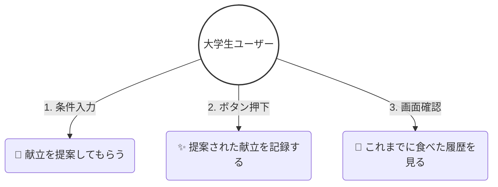
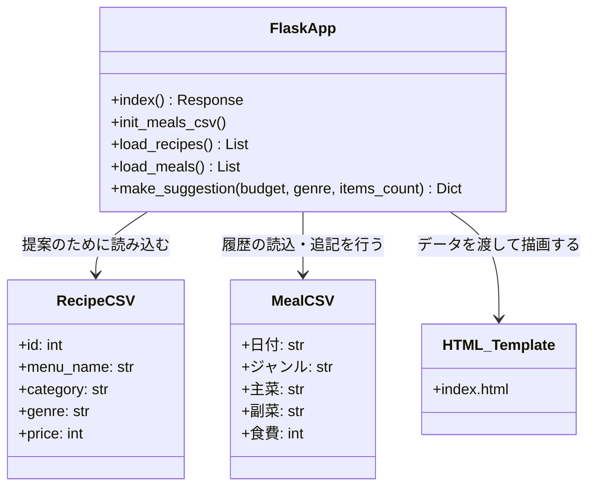
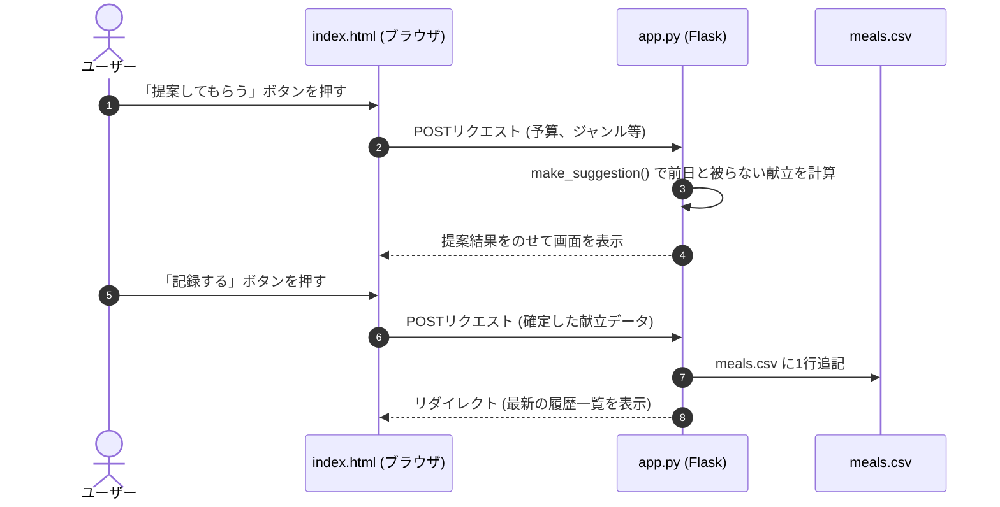
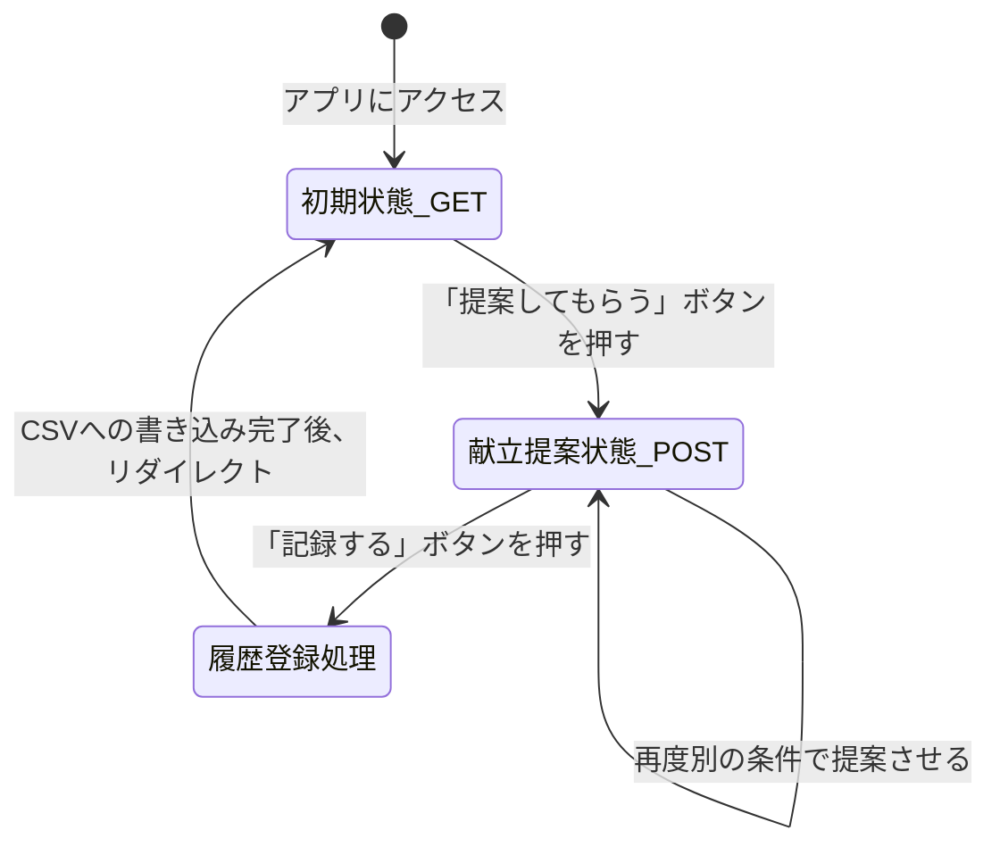

# 一人暮らし向け献立管理・提案Webアプリ

大学生の一人暮らしをターゲットに、日々の献立作成と食費管理をスマートに支援するWebアプリケーションです。
「予算内で抑えたいけれど、栄養バランスも崩したくない」という自炊の悩みを解決します。

---

## 📌 アプリケーション概要

「毎日同じメニューになってしまう」「外食が増えて食費がかさむ」「栄養が偏って体調を崩しがち」といった、一人暮らし特有の課題を解決するために設計されました。

ユーザーが予算や料理ジャンル、希望の品数を入力すると、**「前日の食事履歴と重ならない主菜」**を自動で選択し、最適な献立を提案します。また、食事履歴（CSVデータ）を分析し、現在不足している栄養素を視覚化することで、今日優先して摂取すべき栄養素を一目で把握・改善できます。

---

## ✨ 実装機能（サブ機能一覧）

本アプリは、以下の6つのコア機能を中心に開発を進めます。

| # | 機能名 | 概要 |
| :--- | :--- | :--- |
| 1 | **献立登録・履歴表示** | 食べた（または予定の）献立を履歴としてCSVに記録し、一覧で確認できる。 |
| 2 | **スマート献立作成** | 予算・ジャンル・品数に応じ、前日と被らない主菜を自動ローテーション提案。 |
| 3 | **栄養不足アラート** | 直近の食事履歴から、今日優先して摂取すべき栄養を分析してトップに表示。 |
| 4 | **栄養情報表示** | 各料理の「タンパク質」「炭水化物」「脂質」などの詳細データを表示・確認。 |
| 5 | **食費記録・月別集計** | 日々の食費を自動で記録し、月ごとの合計金額が予算内か管理する。 |
| 6 | **食費推移グラフ** | 日ごと・月ごとの食費の動きを、視覚的なグラフで分かりやすく表示。 |

---

## 🚫 スコープ外（作らないもの）

開発の俊敏性と中心機能への集中を目的として、以下の機能は実装**しません**。

* ❌ ログイン機能 / 複数ユーザー対応（完全なローカル・シングルユーザー仕様）
* ❌ 通知機能（リマインドやプッシュ通知など）
* ❌ 食材の在庫管理機能（冷蔵庫の中身の管理など）
* ❌ 外部レシピAPIとの連携（外部サイトとの自動同期など）
* ❌ レシピ動画の表示機能

---

## 🛠 使用技術

* **言語**: Python 3.x
* **フレームワーク**: Flask
* **フロントエンド**: HTML5 / CSS3
* **データ管理**: CSVファイルによる軽量データストア（DBサーバー不要）

---

## 🚀 動作手順（ローカル起動方法）

### 1. 必要なライブラリのインストール
ターミナル（またはコマンドプロンプト）を開き、Flaskをインストールします。
```bash
pip install flask

---

## 📊 設計図（UMLダイアグラム）

GitHub上では、以下のコードが自動的に図としてレンダリングされます。

### 1. ユースケース図 (Use Case Diagram)
ユーザーがこのアプリで何ができるかを表した図です。



### 2. クラス図 (Class Diagram)
アプリのデータ構造と関数の関係性を表した図です。



### 3. シーケンス図 (Sequence Diagram)
ユーザーの操作に合わせて、画面・プログラム・CSVファイルの間でどのようにデータがやり取りされるかを表した図です。



### 4. 状態遷移図 (State Diagram)
ユーザーの操作によって、アプリの画面がどういう「状態」に移り変わるかを表した図です。

